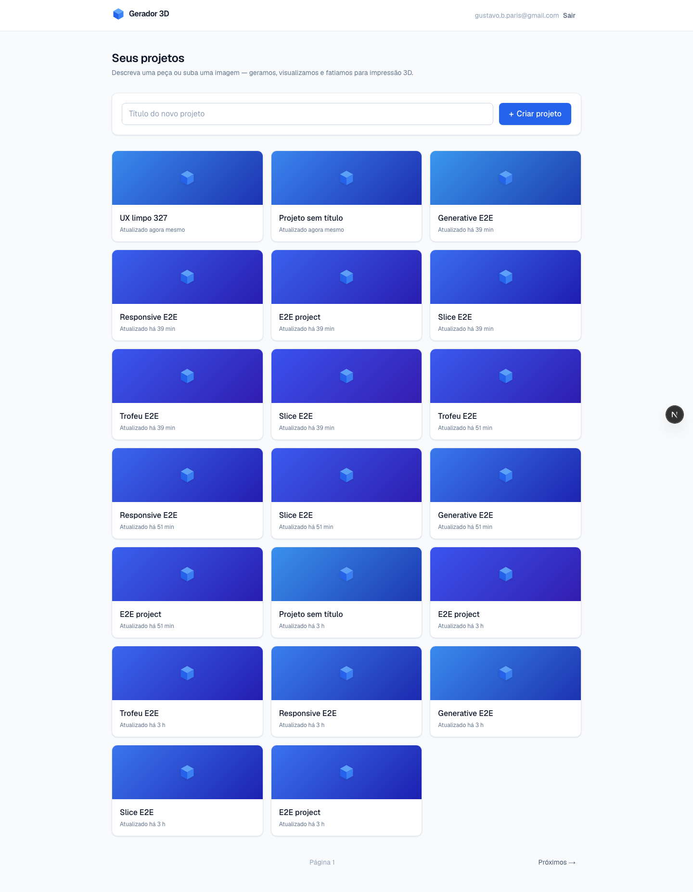
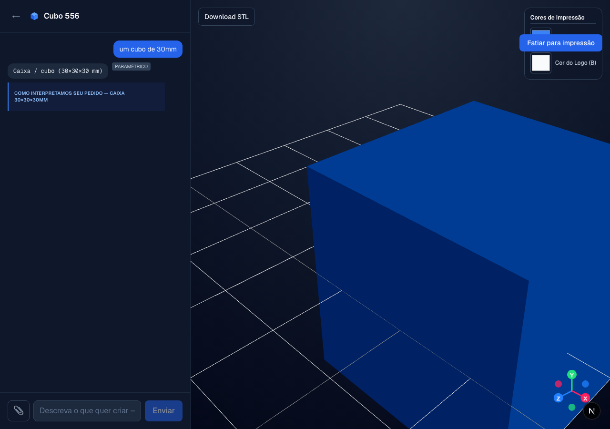
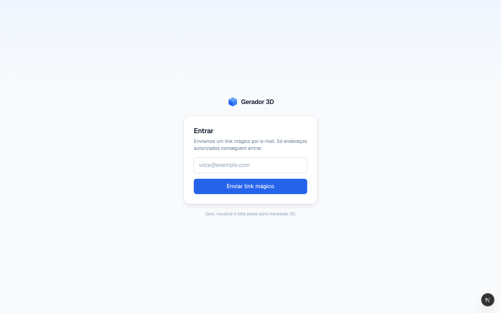

# Gerador 3D — chat → 3D model → printer-ready file

Describe a part in plain language (or drop in a logo image) and get a **printable
3D model** you can preview, color for multi-material, and slice to a `.3mf`. Bring
your **own AI provider** and your **own Meshy account** — it's self-hostable and
open source.



## How it works

Two generation engines, picked automatically per request:

- **Parametric (no external 3D service).** An LLM turns your request into a
  structured `Design` (box/cube, disc/medal, flat plate, sleeve, bookmark, pin,
  mug, keychain…), which a deterministic [JSCAD](https://openjscad.xyz/) generator
  builds into a watertight mesh — fast, free, repeatable. Logos are vector-traced
  from an uploaded image and engraved / embossed / cut through.
- **Freeform (Meshy).** Organic shapes the primitives can't express (animals,
  characters, busts) route to [Meshy](https://meshy.ai) text/image-to-3D.

Then: real-time 3D viewer (three.js), per-extruder colors for the Bambu H2D, an
advisory mesh-validity check, and **Slice → `.3mf`** via an OrcaSlicer microservice.

| Studio (workspace) | Sign in |
|---|---|
|  |  |

## Quick start

```bash
git clone https://github.com/Gustavo-Paris/3dprint-generator.git
cd 3dprint-generator
docker compose up -d postgres          # local Postgres
cp .env.example .env.local             # fill in the required vars (below)
pnpm install
pnpm db:migrate                        # apply schema
pnpm dev                               # http://localhost:3000
```

Sign in with a magic link (Resend), then open **⚙ Configurações** to connect your
AI provider and Meshy key — or set them via env vars (see below).

## Configuration

You can configure everything **two ways**, and they compose: a value set in the
in-app **Settings** page (stored **encrypted** in the database) overrides the
matching environment variable, field by field. So a fresh deploy can run on env
only, and you can later tweak keys from the UI without redeploying.

### Required env vars (`.env.local`)

| Var | What it's for | How to get it |
|---|---|---|
| `DATABASE_URL` | Postgres connection | docker compose / your host |
| `AUTH_SECRET` | Auth.js session encryption (also derives the settings-encryption key) | `pnpm dlx auth secret \| tail -1` |
| `AUTH_RESEND_KEY` | Magic-link email | [resend.com](https://resend.com) → API Keys |
| `AUTH_EMAIL_FROM` | Verified sender address | a Resend-verified address |
| `AUTH_ALLOWED_EMAILS` | Comma-separated sign-in allowlist | your email(s) |

### AI provider — bring your own (OpenAI-compatible)

Any endpoint that speaks the OpenAI API works — set it in **Settings** or via env:

| Var | Example |
|---|---|
| `AI_BASE_URL` | `https://api.openai.com/v1` |
| `AI_API_KEY` | your provider key |
| `AI_MODEL` | `gpt-4o-mini` |
| `AI_CLASSIFIER_MODEL` | *(optional; defaults to `AI_MODEL`)* |

Tested provider examples:

| Provider | `AI_BASE_URL` | `AI_MODEL` example |
|---|---|---|
| OpenAI | `https://api.openai.com/v1` | `gpt-4o-mini` |
| OpenRouter | `https://openrouter.ai/api/v1` | `anthropic/claude-3.5-sonnet` |
| Together | `https://api.together.xyz/v1` | `meta-llama/Llama-3.3-70B-Instruct-Turbo` |
| Groq | `https://api.groq.com/openai/v1` | `llama-3.3-70b-versatile` |
| Ollama (local) | `http://localhost:11434/v1` | `llama3.1` |

> Legacy fallbacks are still honored if no OpenAI-compatible config is present:
> `AI_GATEWAY_API_KEY` (Vercel AI Gateway) or `ANTHROPIC_API_KEY`.

### Meshy (optional — freeform shapes)

| Var | Notes |
|---|---|
| `MESHY_API_KEY` | Get one at [meshy.ai](https://meshy.ai). Without it, organic requests fall back to the closest parametric primitive. |

### Slicer & storage (optional)

| Var | Notes |
|---|---|
| `SLICER_URL` | OrcaSlicer microservice for `Slice → .3mf` (defaults to `http://localhost:8787`) |
| `BLOB_READ_WRITE_TOKEN` | Vercel Blob for storing sliced files; if absent, `.3mf` is returned inline |

## Tests

```bash
pnpm test            # unit + integration (Vitest) — needs the local Postgres up
pnpm test:e2e        # end-to-end (Playwright) — sets E2E_ALLOW_TEST_LOGIN itself
pnpm test:coverage   # gated coverage on the core libs
```

## Deploy

See [`docs/DEPLOY.md`](docs/DEPLOY.md) for Railway / Vercel + the slicer service.

## Architecture

- **Next.js (App Router) + Tailwind v4** — UI + API routes.
- **Postgres + Drizzle** — projects, iterations, and the singleton `app_settings`
  (encrypted keys). Auth.js (magic link via Resend).
- **`src/lib/design`** — `parse` (LLM → `Design`), `sanitize` (printability clamps),
  `generate` (JSCAD primitives → mesh). **`src/lib/meshy`** — freeform.
- **`src/lib/llm/model.ts`** — resolves the model from Settings/env (OpenAI-compatible,
  with gateway/Anthropic fallbacks). **`src/lib/settings`** + **`src/lib/crypto`** —
  config resolution + at-rest secret encryption.
- LLM-generated JSCAD runs in a **sandboxed Web Worker** (`src/lib/jscad/sandbox.ts`).

## Security

API keys are encrypted at rest (AES-256-GCM; key derived from `AUTH_SECRET`) and
never sent back to the browser in plaintext. LLM-generated code only ever executes
inside the Web Worker sandbox — `git grep -nE "FunctionCtor|dynamicEval"` must only
hit that one file. Report vulnerabilities via a private GitHub security advisory.

## Contributing

PRs welcome — see [`CONTRIBUTING.md`](CONTRIBUTING.md).

## License

[MIT](LICENSE) © 2026 Gustavo Paris
